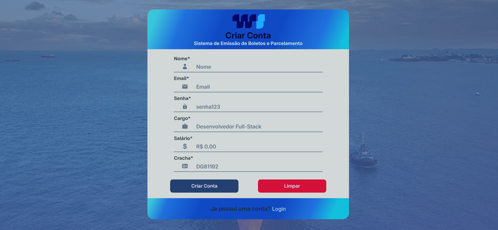
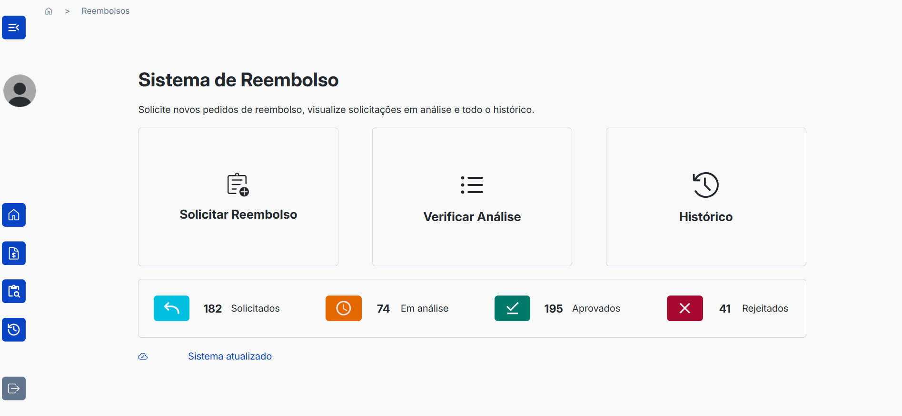
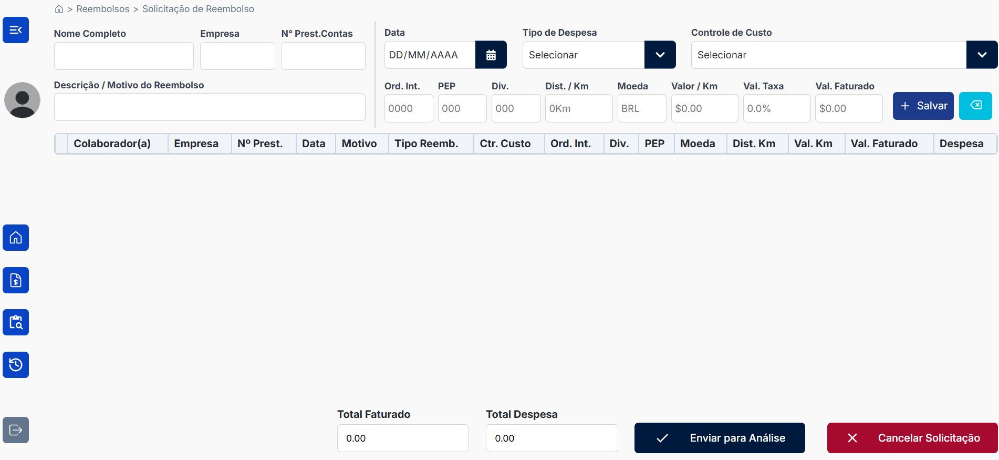
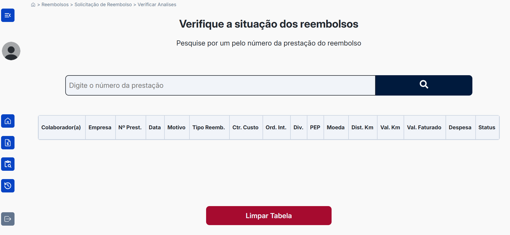

# SISPAR - Sistema de Emissão de Boletos e Parcelamento


O SISPAR é um sistema web moderno para gerenciamento de reembolsos corporativos, com autenticação segura, solicitação de reembolsos e acompanhamento de análises.

## Funcionalidades Implementadas

### 🚪 Autenticação de Usuário
- **Login seguro** com validação de credenciais
- **Criação de conta** com campos obrigatórios
- Armazenamento seguro de sessão no localStorage
- Notificações toast para feedback de ações

### 📋 Dashboard de Reembolsos
- **Visão geral estatística** (solicitados, em análise, aprovados, rejeitados)
- **Cartões de ação rápida**:
  - Solicitar novo reembolso
  - Verificar análises em andamento
  - Acessar histórico completo
- Interface intuitiva com ícones descritivos

### 🔄 Fluxo de Navegação
1. Login → Dashboard
2. Dashboard → Solicitação de Reembolso
3. Dashboard → Análise de Reembolsos
4. Link para criação de nova conta

### ✨ Recursos Técnicos
- **100% Responsivo** (mobile, tablet, desktop)
- **Animações suaves** entre transições de tela
- **Validação de formulários** em tempo real
- **Tratamento de erros** detalhado
- **Ícones intuitivos** em todas as seções

## Telas do Sistema

### 1. Tela de Login

- Campos: Email e Senha
- Links: "Esqueci minha senha" e "Criar conta"

### 2. Criação de Conta

- Campos: Nome, Email, Senha, Cargo, Salário, Crachá
- Validação em tempo real
- Efeitos visuais no carregamento

### 3. Dashboard Principal

- Estatísticas de reembolsos
- Cartões de ação rápida
- Breadcrumbs de navegação

### 4. Solicitação de Reembolso

- Formulário de solicitação
- Tabela com a solicitação feita
- Botão para cancelar a solicitação

### 5. Análise de Reembolsos

- Input para pesquisar reembolsos pelo numero de prestação
- Tabela com reembolsos em análise
- Botão para limpar tabela

## Próximas Atualizações (Roadmap)

### 👤 Área do Usuário
- [ ] Visualização de perfil
- [ ] Atualização de informações
- [ ] Exclusão de conta
- [ ] Alteração de senha ou atualização de dados

### 🔄 Gerenciamento de Reembolsos
- [ ] Edição de solicitações existentes
- [ ] Exclusão de reembolsos
- [ ] Upload de comprovantes
- [ ] Filtros avançados no histórico
- [ ] Validação/Aprovação de reembolsos

### 📊 Melhorias na Interface
- [ ] Adição de ilustrações personalizadas em cada seção
- [ ] Tema escuro/claro
- [ ] Dashboard administrativo


## Tecnologias Utilizadas

- **React** 
- **React Router**
- **SCSS Modules** 
- **React Icons** 
- **React Toastify**

## Como Executar o Projeto

1. Clone o repositório:
```bash
git clone https://github.com/dgarauj04/sispar-vnwb.git
```

2. Instale as dependências:
```bash
npm install
```

3. Inicie o servidor de desenvolvimento e acesse o site em seu localhost:
```bash
npm run dev
```
## Ou acesse diretamente pelo link do projeto:

https://sispar-vnwb.vercel.app/